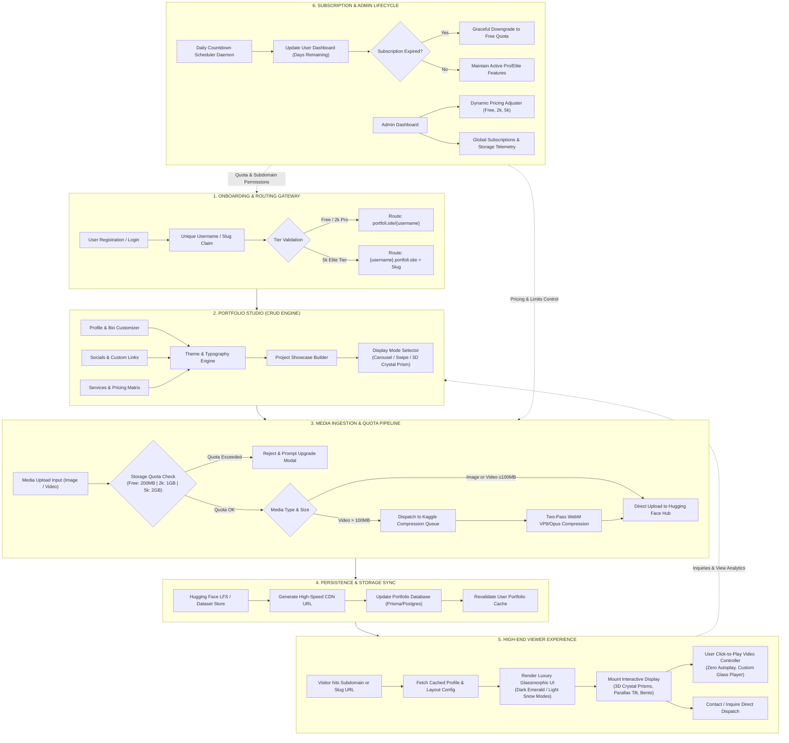

# portfoli — Luxury Multi-User Glassmorphic Portfolio Platform

**portfoli** is a high-performance, multi-user portfolio SaaS platform designed to give creators, developers, designers, and agencies an ultra-confident, prestigious web presence.

---

## 💎 Signature Visual & Interactive Design
- **Theme Aesthetics**: Obsidian Dark Mode (`#070a08` with glowing `#00FF87` emerald accents) and Snow Pearl Light Mode (`#ffffff` with `#059669` jade accents).
- **4 Bespoke Display Modes**:
  1. **3D Crystal Prism**: Interactive multifaceted 3D glass prism cards with dynamic light refraction and facet switching.
  2. **Side-Swipe Cards**: Fluid horizontal slider with velocity-matched kinetic parallax motion.
  3. **3D Carousel**: Rotating focal carousel with active center stage and depth scaling.
  4. **Luxury Bento Grid**: Asymmetrical editorial masonry grid with glass lightbox inspect.
- **Zero Autoplay Video Player**: Strict click-to-play interaction with glowing emerald glass controls and theater lightbox.

---

## 🚀 Tier System & Quotas

| Tier | Price | Video Limit | Image Limit | Storage Quota | URL / Subdomain | Key Features |
|---|---|---|---|---|---|---|
| **Free Starter** | ₦0 / yr | 1 Video | 5 Photos | 200 MB | `portfoli.site/username` | Carousel & Bento Grid Modes |
| **Creator Pro** | ₦2,000 / yr | 10 Videos | 70 Photos | 1 GB | `portfoli.site/username` | Side-Swipe Cards, Custom Fonts, Daily Countdown |
| **Elite Mastery** | ₦5,000 / yr | Unlimited | Unlimited | 2 GB (Hard Cap) | `username.portfoli.site` (Custom Subdomain) | 3D Crystal Prism, Kaggle WebM Video Pipeline, Zero Branding |

---

## ⚡ Data Flow Kanban Rectangular Cycle

---

## 🛠️ Technology Stack
- **Framework**: Next.js 14 (App Router) + TypeScript
- **Styling**: Tailwind CSS + Custom Glassmorphism Shader Tokens
- **Motion & 3D Optics**: Framer Motion
- **Icons**: Lucide React
- **Storage**: Hugging Face Hub Dataset API (`epic98/portfoli-media`)
- **Video Compression**: Kaggle Kernel Two-Pass VP9 WebM Pipeline
